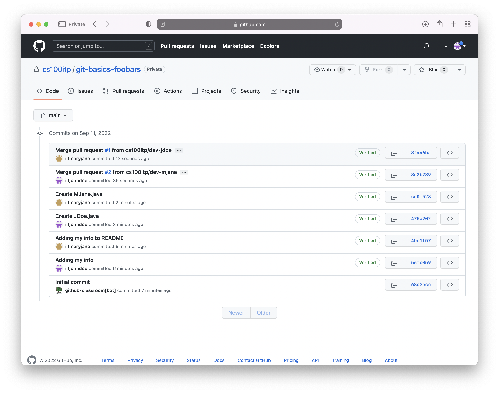

# CS 100 Git & GitHub Assignment

## Team members

(Delete this line and replace it with your information!)

## Git & GitHub

Git is a distributed Version Control System (VCS) -- currently the most popular
VCS in the world. Git tracks changes made to a collection of files (known as a
*repository*) over time. A Git repository maintains a record of every discrete
set of changes (known as a *commit*) made to it, along with the corresponding
author and timestamp. A single commit might, for instance, involve
inserting/deleting/modifying multiple lines or even files across the repository.
Git allows us to view the differences between separate versions of a file, and
to switch between snapshots of all repository files at different points in time.

GitHub is a platform that allows us to store and manage Git repositories in the
cloud. The distributed nature of Git means that a repository can be easily
*cloned* -- i.e., we can copy the full record of all files and their changes to
a different machine. Developers working on separate clones of a single
repository may want to eventually synchronize or otherwise consolidate their
changes, using various features of Git and GitHub.

## Assignment Overview

For this assignment, we will have you work through a Git-based process of which
you'll likely encounter many variations of in future classes and real-world
projects. To make things a bit more interesting, you will work in teams of 2-3
students.

Here's an overview of what each team will do:

1. One team member will create a new team and accept the group assignment at
   this link: <https://classroom.github.com/a/YsKqJKrz>. You're free to come up
   with a unique team name, but keep it PG-13!

2. The remaining team members will use the same link above to join the
   previously created team. At this point, all team members will have access to
   the same repository hosted on GitHub, and shared with the course instructors
   and TAs.

3. Each team member will clone the repository to their own computer.
   
4. One team member will edit the `README.md` file in the repository, updating it
   with their own personal information. They will then commit and push their
   changes to GitHub.

5. Every other team member, in turn, will need to pull the changes from GitHub
   into their own local repository. After doing this, they will add their own
   personal information to the `README.md` file, then commit and push their
   changes.

6. Each team member will create a new branch in their local repository and add
   and commit a new file to that branch. In order to have these changes
   incorporated into the main branch, each team member will publish the branch
   and create a *pull request*.

7. For each outstanding pull request, a team member *other than the one who
   created it* will merge it into the main branch. In this way, each team member
   will act as the repository maintainer.

By the end of the assignment, each team will have a repository containing one
additional branch and file for each member, and a series of commits that look
something like this:

## Details
